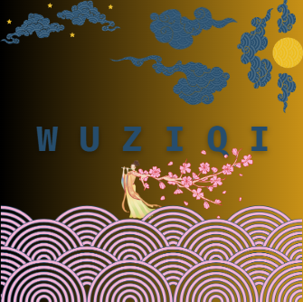

Go-Moku or Wuziqi is a traditional Japanese game (similar to Go) where two players must find a way to compose a five-space line made up of their respective pieces. The name officially translates to: “five points” – the initial game can be likened to the rules of: ‘tic-tac-toe'. 

[Program Runthrough](https://www.youtube.com/watch?v=qQFRm5wmXKo&t=367s)

## Table of Contents
- [Background](#Background)
- [Controls](#Controls)
- [Rules](#Rules)
- [Information](#Information)

## Prerequisites
- Visual Studio 2019 or Higher
- Python 3.8 or higher
- Windows, macOS, or Linux operating system
- Only *Keyboard* can be used as input device

## Background:
A small section dedicated to the history of the game:
:- 
First made in Japan in 270BC, as part of the game: “Gobang”  (which utilises both the same board and pieces), the Asian board game is said to be over 4000 years old and was originally named: “Kakugo” – which directly translates to; “five-steps” – denoting the key trope of five in a row. 
In the book written in 100AD, they describe the game; “Go” as a national past-time in Japan – similar to the way in which chess is viewed in western cultures. Furthermore, the game has since evolved and was first introduced into Britain in the 19th Century, where it was referred to as; “Go-Bang” and in 1885, ‘Go-Moku’ was introduced to the European culture where it was labelled: “Spoil Five”.
To this day Go-Moku remains one of the most popular Japanese games – alongside other ones like: “Alpha-Go”. The Renju International Foundation  conduct international events and competitions for professional Go-Moku players – the Hungarian chairman of the committee: Attila Demjan founded the RIF on the 8th of August 1998.

## Controls:
W / ⬆️ --> UP
:-
A / ⬅️ --> LEFT
S / ⬇️ --> DOWN
D / ➡️ --> RIGHT

## Rules:
1. **🎮OBJECTIVE🎲** Win by getting five stones in a row, any direction!
2. **🧑‍🦲VARIATE💁** Place one stone at a time, trying to outsmart your opponent.
3. **👑WIN👑** Be the first to get five in a row, or if the board fills up with no winner, it's a draw!

## Information:
-  this program was originally intended for educational use meaning there will be some mistakes and some elements remain incomplete.
-  the image used at the top of this file was compiled using 'Canva' business graphics created by other people

  
